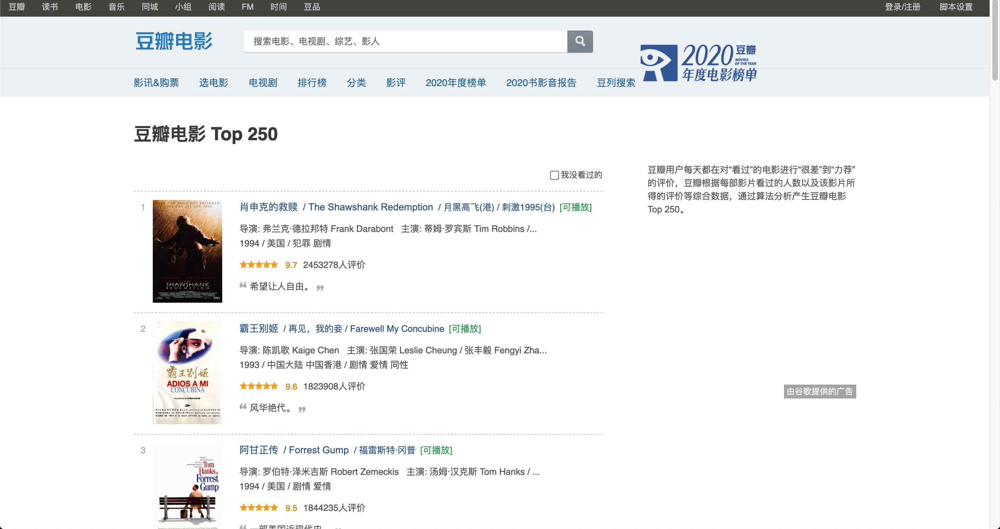
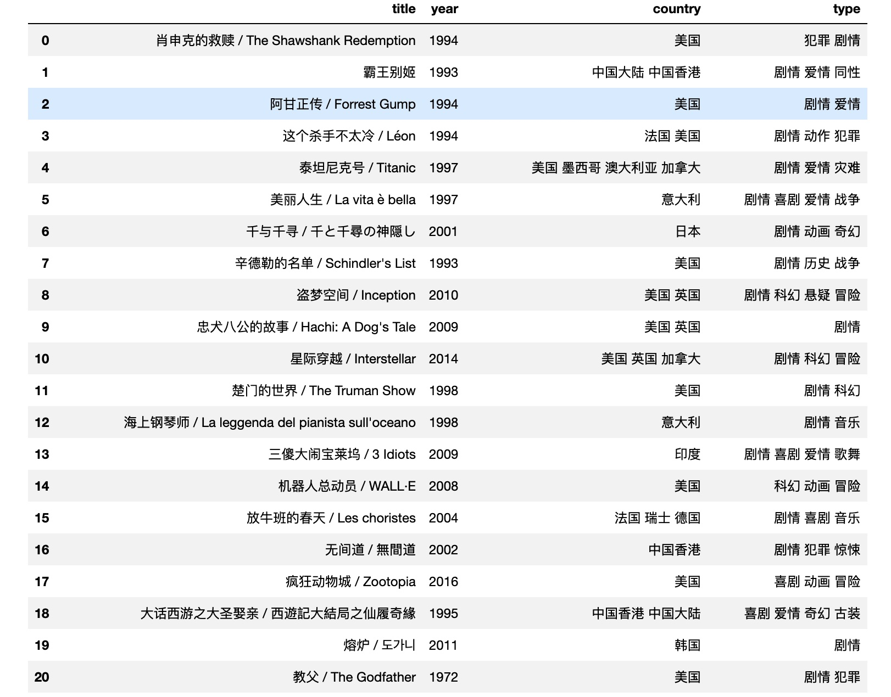
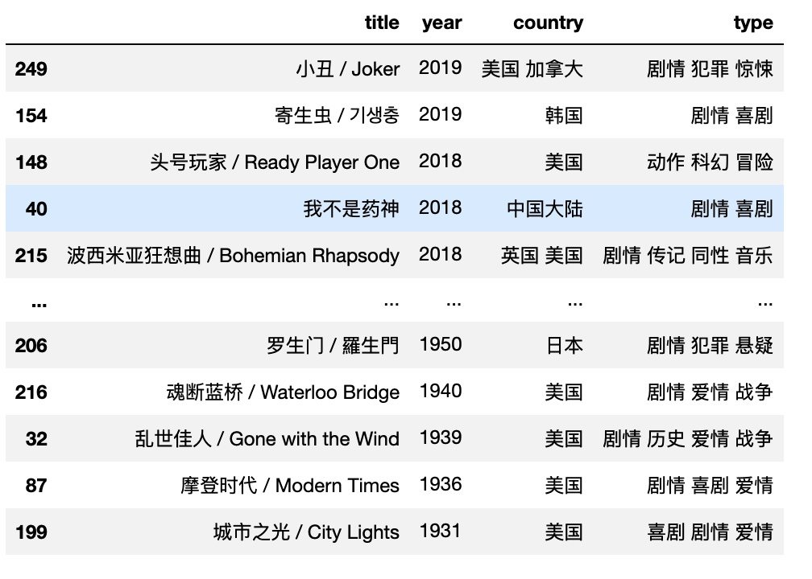
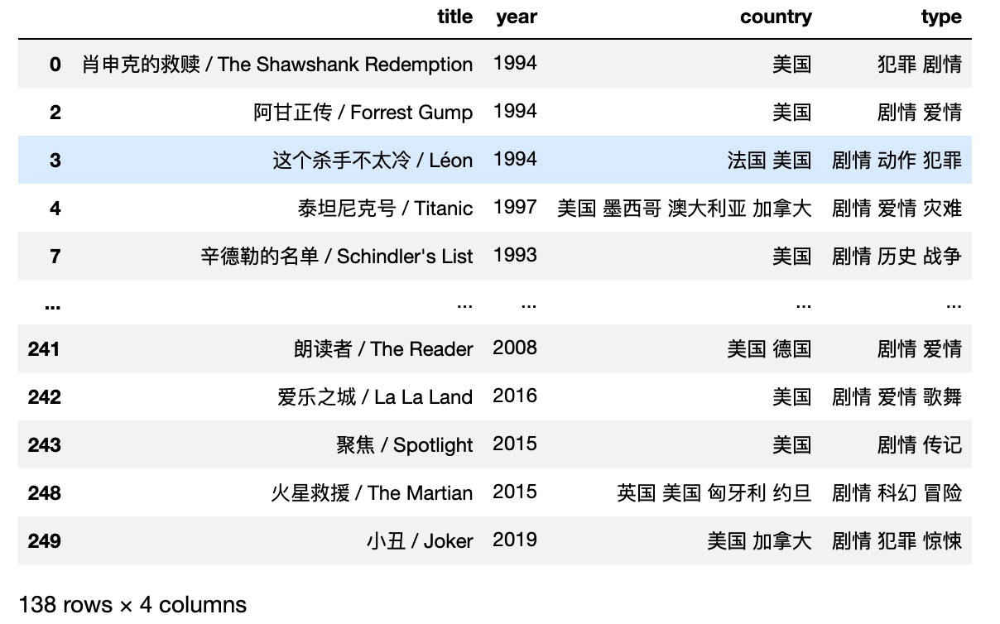
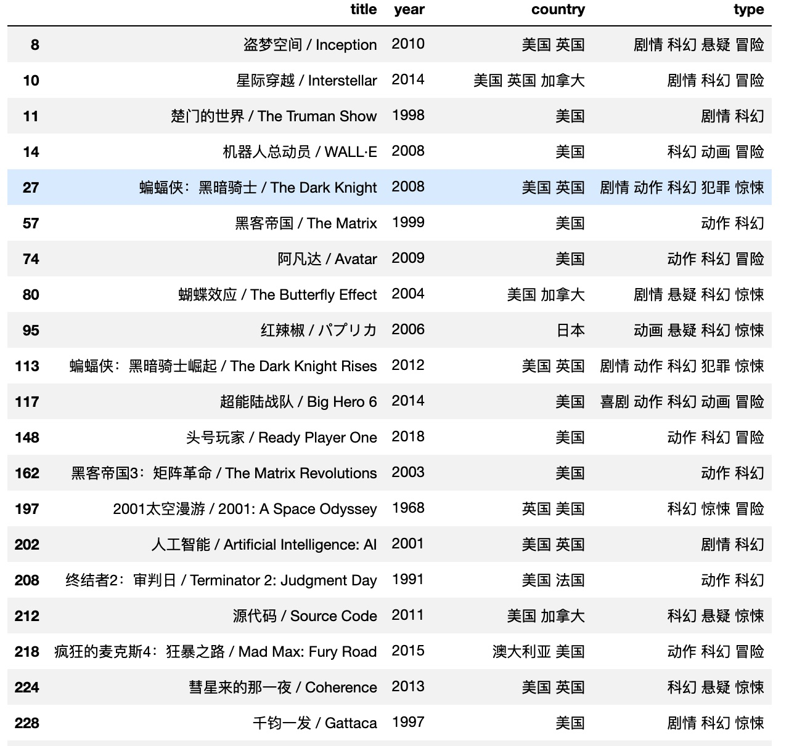
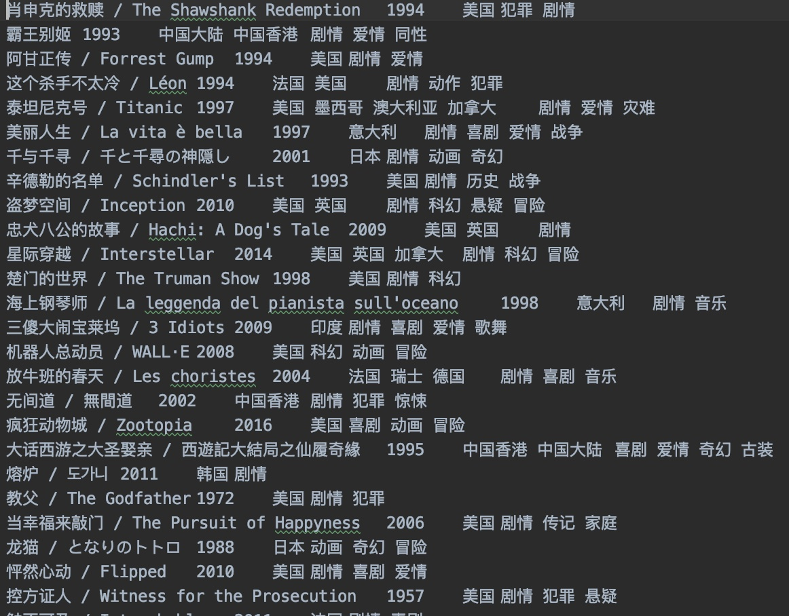

# douban-top250-movie

## About
**Douban** is a Chinese social networking service website that allows registered users to record information and create content related to film, books, music, recent events, and activities in Chinese cities. It is similar to IMDB. On douban, there is a page that lists the top rated 250 movies in history: [https://movie.douban.com/top250](https://movie.douban.com/top250). However, there doesn't exist a filter option on for movies on that page, which is stange. Therefore, this project is to use web crawler to scrape those 250 movies' information and then sort those based on different criteria such as year, region, type, actors.

Use BeautifulSoup to parse HTML and extract info from its attribute, organize those info using a list of dictionary.
Then, by using DataFrame in pandas, it is easy to sort on any features.

Sort by year descendingly: 
`df.sort_values(by=['year'], ascending=False)`

Select movies from U.S.: 
`df[df['country'].str.contains('美国')]`

Select Sci-fi type movies: 
`df[df['type'].str.contains('科幻')]`

Those 250 movies will be saved to a txt file under current working directory, with each movie's information on a line. You can later load it in python.

