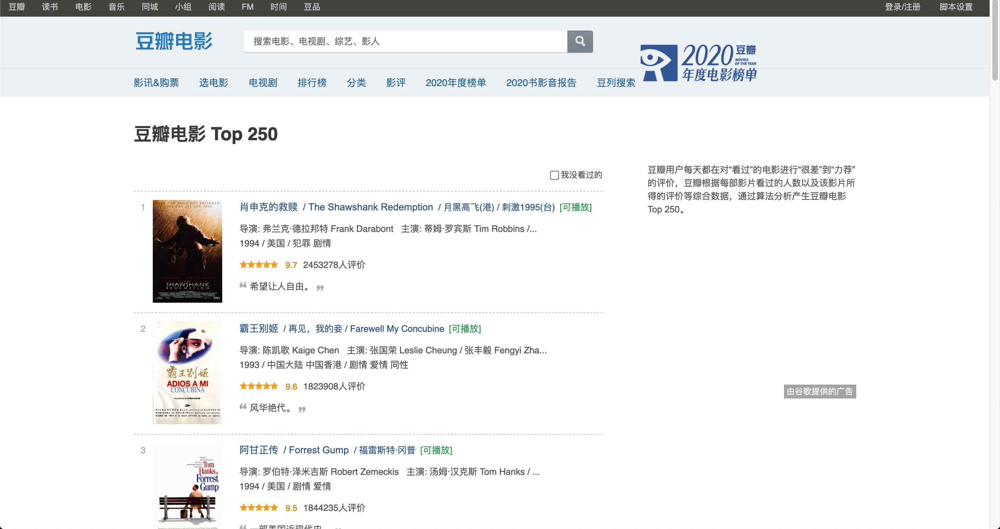
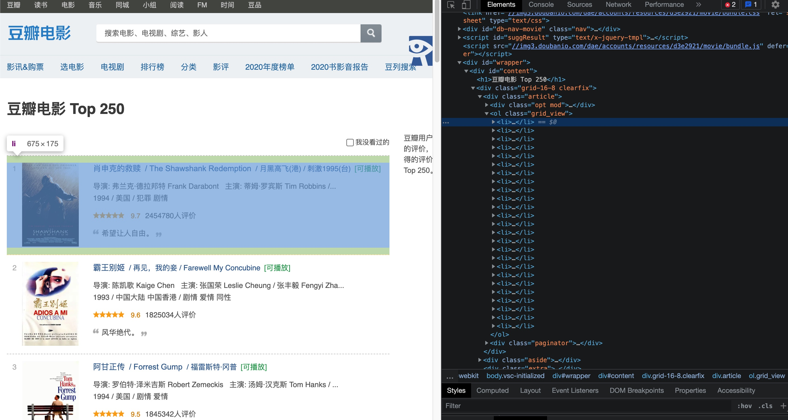
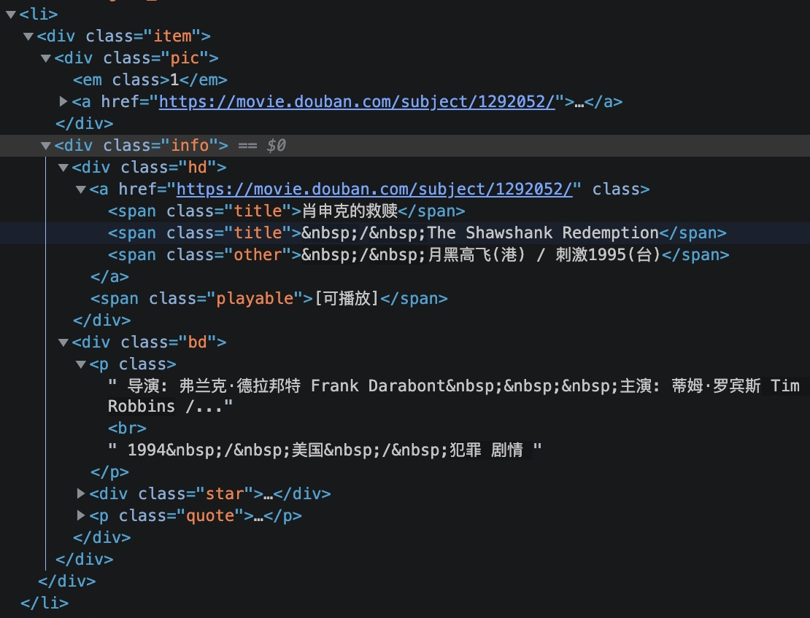
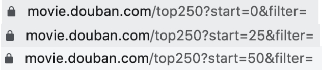
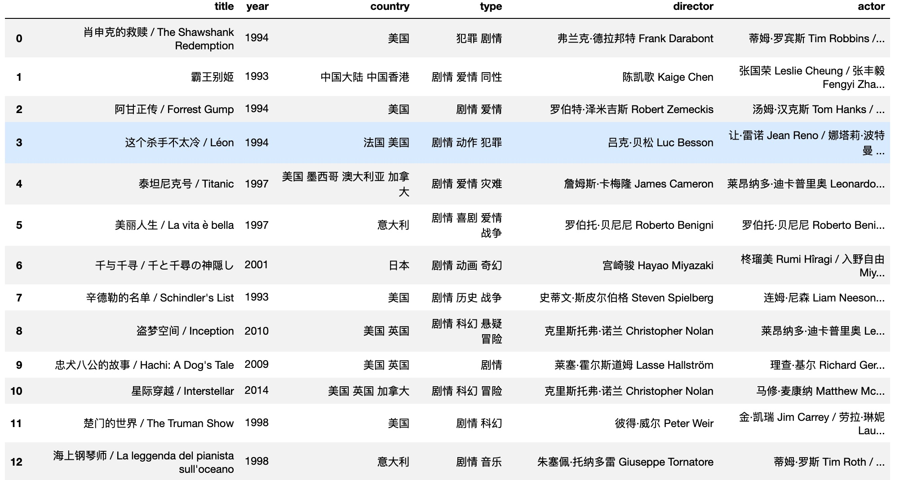
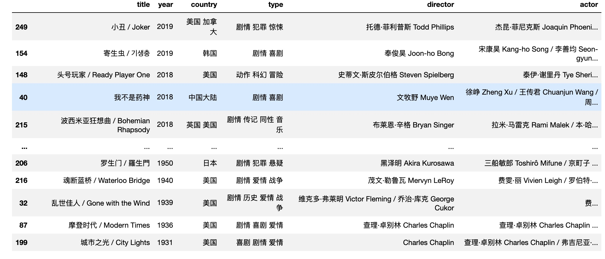
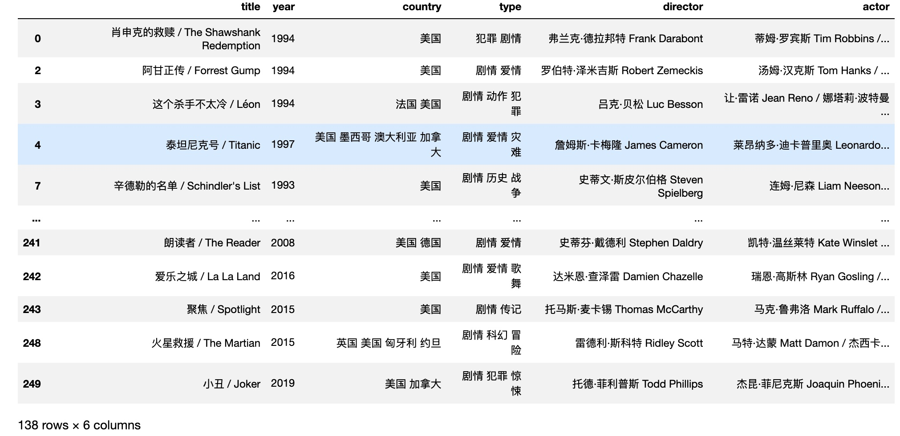
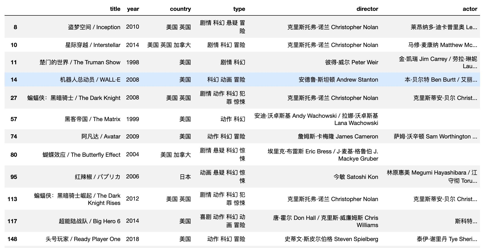

# douban-top250-movie

## About
**Douban** is a Chinese social networking service website that allows registered users to record information and create content related to film, books, music, recent events, and activities in Chinese cities. It is similar to IMDB. On douban, there is a page that lists the top rated 250 movies in history: [https://movie.douban.com/top250](https://movie.douban.com/top250). However, there doesn't exist a filter option on for movies on that page, which is stange. Therefore, this project is to use web crawler to scrape those 250 movies' information and then sort those based on different criteria such as year, region, type, actors.

## Steps
We will use BeautifulSoup to parse HTML and extract elements from it. From those elements, we would be able to get movie information and then organize those info using a list of dictionaries. Then, by transforming that into a DataFrame in pandas, it is easy to sort on any features.

First, we can take a look at the raw HTML to explore the structure. It's easy to see that each movie info on the page is stored in the **\<li>...<\li>** tag.

By using BeautifulSoup's `find_all()` method, we would get all the \<li> taga on the page along with their descendants.

Then, we need to look into each \<li> tag to find where related info are stored.

After inspecting the HTML further, we see the title of movie is stored in **\** tag, with a class named "title." Similarly, other info like directors, actor, year, country, type are stored in the **\
** tag. Therefore, it should be easy to get retrieve those information using `find()` method of BeautifulSoup.

Another thing to notice is that since those 250 movies are distributed on 10 different pages instead of a single page, it's necessary to go through all those pages. By inspecting the link address of each page, we can see a pattern that the number after "start=" is a multiple of 25 on each page. Therefore, simply changing that number in the link address will get us to the next page.

Sort by year descendingly: 
`df.sort_values(by=['year'], ascending=False)`

Select movies from U.S.: 
`df[df['country'].str.contains('美国')]`

Select Sci-fi type movies: 
`df[df['type'].str.contains('科幻')]`

Those 250 movies will be saved to a txt file under current working directory, with each movie's information on a line. You can later load it in python.

